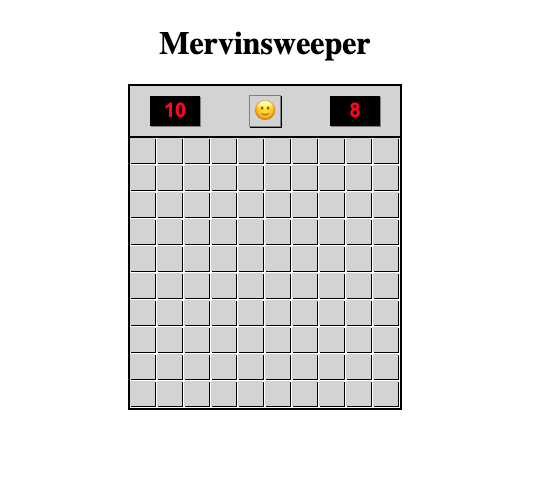

<!-- TABLE OF CONTENTS -->
## Table of Contents

* [About the Project](#about-the-project)
  * [Built With](#built-with)
  * [Installation](#installation)


<!-- ABOUT THE PROJECT -->
## About The Project

This is a single page application mock of the famous game Minesweeper.



### Built With
* React
* Redux
* Node.js
* Express

<!-- GETTING STARTED -->

### Installation

1. Clone the repo
```sh
git clone https://github.com/mervinpan/mervinsweeper.git
```
2. Install NPM packages
```sh
npm install
```
3. Run compiler
```sh
npm run build
```
4. Start server
```sh
npm start
```

